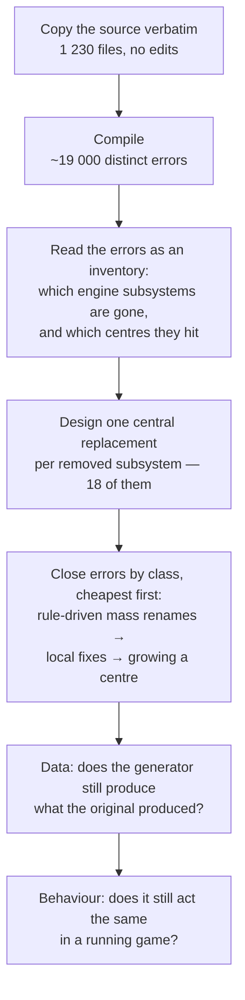

**English** · [Русский](README.ru.md)

# GregTech 6 for NeoForge

[](https://github.com/wolfram0108/gregtech6_w/actions/workflows/build.yml)
[](https://github.com/wolfram0108/gregtech6_w/releases)
[](LICENSE)

**A port of [GregTech 6](https://github.com/GregTech6/gregtech6) — Gregorius Techneticies' mod for
Minecraft 1.7.10 — to Minecraft 26.1.2 / NeoForge.**

| | |
|---|---|
| Minecraft | `26.1.2` |
| NeoForge | `26.1.2.77` |
| Java | 25 |
| Upstream | GregTech 6 `v6.17.06` (Minecraft 1.7.10, Forge 10.13.4) |
| License | LGPL-3.0-or-later, inherited from upstream |

> ### ⚠️ Alpha
>
> The mod builds, boots on client and dedicated server, generates its world and is playable end to
> end. It is **not** finished. Expect bugs, expect saves to break between builds, and do not use a
> world you care about. What is known to be unfinished is listed in
> [Current state](#current-state) rather than left for you to discover.

---

## Contents

- [What GregTech 6 is](#what-gregtech-6-is)
- [Why porting it is hard](#why-porting-it-is-hard)
- [The architecture that had to survive](#the-architecture-that-had-to-survive)
- [How the port was executed](#how-the-port-was-executed)
- [The eighteen seams](#the-eighteen-seams)
- [How correctness is judged](#how-correctness-is-judged)
- [Current state](#current-state)
- [Building](#building)
- [Running](#running)
- [Tests](#tests)
- [Development tooling](#development-tooling)
- [Continuous integration](#continuous-integration)
- [Mod compatibility](#mod-compatibility)
- [Reporting problems](#reporting-problems)
- [License and credits](#license-and-credits)

---

## What GregTech 6 is

GregTech 6 turns Minecraft into an industrial process game. Ore is not "iron ore that smelts into
iron" — it is a material with a chemical composition, a hardness, a melting point, a set of
by-products and a place in a processing chain that runs from a hand-cranked hammer up through
furnaces, crushers, centrifuges, boilers, engines, multiblock reactors and pressurized fluid
logistics. Wood, stone, rubber, alloys and dozens of fluids each have their own chains, and the
vanilla ones are replaced rather than sitting beside GT6's.

The technically unusual part is that almost none of this is written out by hand. GT6 is built on a
**material × prefix matrix**: it knows several hundred materials and several hundred item shapes
("ingot", "dust", "small gear", "double plate"…) and *generates* the resulting items, blocks, ore
dictionary entries, textures, names, recipes and machine behaviour at load time from the rules for
each combination. The mod is, in essence, one large generator plus the data it consumes.

For a port this matters more than any single feature. Porting the generator's **output** would be
pointless — the thing that has to survive the move is the **generator itself**, together with the
exact order in which it runs, because everything else in the mod is derived from it.

Scale, for context: about 200 000 lines of Java in ~1 230 classes, plus roughly 20 000 asset files.

## Why porting it is hard

GregTech 6 was written for Minecraft 1.7.10 (2014). Between that version and 26.1.2 essentially
every engine subsystem the mod depends on was removed or replaced — not deprecated, removed:

| What GT6 uses in 1.7.10 | What happened to it |
|---|---|
| Item metadata (`ItemStack` = item + damage value) | gone; item identity is now item + data components |
| Block metadata (0–15 per position) | gone; a block is a single block state |
| The block `Material` system (stone / wood / metal…) | removed as a concept |
| Immediate-mode rendering (`IIcon`, `Tessellator`, GL calls, TESRs) | removed; everything is baked models now |
| Forge's `OreDictionary` | removed |
| `IWorldGenerator` (imperative world generation) | replaced by data-driven features and biome modifiers |
| The fluid system (`Fluid`, `BlockFluidClassic`) | split apart and rebuilt |
| The networking layer (`SimpleNetworkWrapper`) | replaced |
| Vanilla crafting registration from code | removed; recipes are datapack JSON |
| The coremod / bytecode-transformer entry point | removed |
| GUI handling (`IGuiHandler`, `Container`, `GuiScreen`) | replaced |
| Achievements | replaced by advancements, with different side effects |

A mod that merely *uses* Minecraft can absorb that kind of change subsystem by subsystem. GT6
cannot, for a structural reason: it is a **monolith**. Its defining property — and the reason it
scales to hundreds of materials without collapsing — is that the conversation with the engine
happens in *one* place. One module talks to the world, one to item stacks, one to NBT, one to the
ore dictionary, and the entire mod goes through them, always. A dependency graph of the source shows
272 of its classes in a single strongly connected component: a knot that cannot be cut into
independently portable slices.

So the port has no "start with a small feature and grow" path available. Either the foundation
stands up as a whole, or nothing runs.

## The architecture that had to survive

GregTech 6 is roughly 200 000 lines across ~1 230 classes, but size is not what makes it hard. Two
structural properties decide everything about how it can be ported.

**It is a generator, not a catalogue.** The mod declares ~407 materials and ~453 prefixes — shapes
such as ingot, dust, small gear, double plate — and derives the rest: items and blocks, ore
dictionary entries, textures, names, tooltips, ~196 fluids, and recipes across ~85 machine types. A
material carries its composition, hardness, melting point, by-products and tool quality; the
generator reads those and produces the world of the mod at load time. Port the output and you get a
snapshot that cannot grow. Port the generator and everything derived from it follows.

**It talks to the engine in one place per subject.** This is what makes GregTech 6 unusual, and the
reason porting it is possible at all:

| Centre | Owns |
|---|---|
| world access | every read and write of blocks, positions, metadata, tile entities |
| item stacks | creation, comparison, size, identity, "is this empty" |
| NBT | reading and writing, including the quirks of wrongly-typed keys |
| ore dictionary | registration, lookup, unification targets |
| materials and prefixes | the generator matrix itself |
| mod presence | whether another mod is installed, asked the same way in ~120 places |
| constants and flags | shared configuration the whole mod reads |
| machine registry | machines are *registry entries with parameters*, not classes — thousands of them from a few dozen behaviours |

Nothing bypasses these. When the engine removed block metadata, the port did not touch the ~1 200
call sites that read it: the world-access centre changed internally, and the call sites stayed
byte-for-byte what Gregorius wrote.

**The consequence: it cannot be sliced.** A dependency graph of the source puts 272 classes in a
single strongly connected component. There is no "start with the boiler and grow" path — the
foundation stands up whole or nothing runs. That ruled out the usual incremental strategy before the
first line was moved.

## How the port was executed



Copying 200 000 lines onto an engine that cannot compile them is a deliberate first move: the
resulting error list is an inventory produced by the compiler rather than by anyone's opinion about
what probably needs attention. Every disagreement between the two engines, enumerated, countable and
shrinking as work proceeds. The seams came out of that list crossed with the dependency graph, not
out of a feature wishlist.

Errors were then closed **by class, never by file**. "This call was renamed" is a rule that applies
to five hundred sites at once and can be applied mechanically; "this file is broken" is five hundred
separate judgement calls. When a class of errors could not be closed by a rule, that was the signal
a real seam had been found and a centre had to grow.

Work that could not be finished on the spot was marked in the code and counted by a script. That
counter is the honesty gauge of the effort: it went 43 → 28 → 23 → 10 → 7 → 5 → 0, and CI checks it
on every push so new deferrals stay visible instead of quietly accumulating.

## The eighteen seams

Places where the original construct has no counterpart at all. Each is one central replacement, not
a family of local workarounds:

| Removed in the modern engine | Replacement |
|---|---|
| item metadata | one item per shape + a material data component |
| coremod bytecode transformation | mixins over the same methods the original patched, plus access transformers |
| immediate-mode rendering | baked models driven by GT6's own texture layer; connection-dependent shapes via model data |
| Forge's ore dictionary | GT6's own registry — it already maintained a richer layer above Forge's |
| the fluid system | fluid data kept as is; world fluids re-parented onto the engine's liquid block so vanilla interactions (freezing, sponges, buckets, lava meeting water) work again, while GT6's finite-quantum flow is preserved |
| imperative world generation | the original vein and layer algorithms wrapped as engine features, placed by biome modifiers |
| the networking layer | the same packets over the modern payload API |
| raw NBT as the data channel | a bridge preserving the original keys and semantics, quirks included |
| the block material system | 1.7.10's categories rebuilt as traits, plus one bridge into modern block properties |
| `@Optional` cross-mod compatibility | the mod-presence centre retained; foreign APIs mirrored at compile time only |
| code-registered crafting recipes | procedural generation into GT6's own recipe buffer, exposed through a single dispatcher |
| the FML mod lifecycle | the mod's own lifecycle centre untouched; only the outermost entry points are modern |
| block position metadata | world-access centre keeps the old signatures; own blocks carry extended metadata |
| the GUI stack | one menu provider, one menu type, original routing preserved |
| `null` as "empty item" | GT6 keeps its own model internally; conversion happens at an enumerated set of engine boundaries |
| mandatory block codecs | one central stub — GT6 blocks are procedural, never data-driven |
| the NBT read API | read helpers centralised, preserving 1.7.10's wrong-type behaviour |
| achievements | a no-op: the modern award carries side effects the original never had |

## How correctness is judged

The original is not documentation to be read — it is a **reference implementation you can run**. A
1.7.10 installation is kept instrumented: it is asked what it does, the port is asked the same
question the same way, and the answers are compared.

| Level | Question it answers |
|---|---|
| Compiler | does it exist and link |
| Comparison against the original | does the generator still produce the same materials, items, ore dictionary entries, recipes, worldgen definitions and names |
| In-engine probes | does the real engine path behave the same — which block actually got placed, what actually ended up in the slot, what the machine actually consumed and produced |
| Side-by-side measurement | for behaviour that exists only while running — fluid spreading, machine timing — the same instrument is compiled into *both* versions and one scenario is run in each |
| Playing the game | everything the instruments cannot see |

Two rules keep this from lying, both bought with failures:

* **A comparison is only as good as its scope.** Matching data proves the generator's *output*
  matches. It says nothing about whether the result reaches the player: an item can be correct in
  every registry and still be invisible, unobtainable or wrongly rendered.
* **A check that cannot fail is not a check.** Every comparison is run once in a state where it is
  known to be broken, to confirm it can see the difference at all.

## Current state

**Working and exercised in play**

* Client and dedicated server boot; worlds generate and are playable.
* The material/prefix generator, ore processing chains, ore dictionary and recipe generation.
* World generation: ores, veins, rock layers, trees and plants, fluid springs, dungeons.
* Machines, energy (electric, steam, kinetic), pipes and wires, multiblocks, item and fluid logistics.
* Crafting, both the vanilla workbench and GT6's own crafting behaviour.
* Rendering, creative tabs, JEI integration, tooltips, item and block models, fluid rendering.
* Vanilla replacement behaviour: GT6 water, tool rules, harvest tiers, block hardness.

* Covers — filters, detectors, shutters, texture covers, pumps.

**Known differences from the original**

* A small number of workbench recipes differ from the original in ore-list composition.

**Alpha warnings**

* Worlds do not reliably survive updates. Some fixes apply only to newly generated chunks — data
  that an earlier build destroyed cannot be reconstructed.
* Dedicated-server play is the newest and least exercised part of the project.

## Building

You need **JDK 25**, about **8 GB of free RAM** and **10 GB of disk**. The first build downloads
NeoForge and decompiles Minecraft, which is what the memory is for (the decompiler inherits the
Gradle JVM heap, set to 6 GB in `gradle.properties`) — and it takes a while. Later builds are fast.

```bash
./gradlew build       # compile, jar, tests
./gradlew assemble    # just the jar -> build/libs/gregtech6-<version>.jar
./gradlew compileJava # just compile
```

## Running

```bash
./gradlew runClient   # development client
./gradlew runServer   # dedicated server (own directory: ./runserver)
./gradlew runData     # regenerate generated data files
```

Client and server deliberately use separate game directories, so both can run at once.

There is one opt-in build flag, `-Pgt6probes`, which adds the in-engine verification probes
(`src/probes/java`) to the build. Without it they are not compiled at all and cannot end up in a
player's jar; with it, `runClient`/`runServer` can run automated in-game checks.

## Tests

```bash
./gradlew test    # 13 tests, no external data required
```

The tests boot the mod inside a headless server and then exercise it: the material and prefix
generator, recipe matching, a machine running a full processing cycle tick by tick, energy transfer,
content registration, and the round trip of items through save and load.

## Development tooling

Two things in this repository are **tools from the porting effort**, not part of the product. They
are off by default, cost nothing when unused, and exist because a port occasionally has to ask
questions an ordinary mod never does.

| Tool | What it answers | How to run |
|---|---|---|
| **Comparison against the original** | "does the mod still generate exactly what GregTech 6 on 1.7.10 generated?" — materials, items, ore dictionary, recipes, worldgen, names | `./gradlew test -Pgt6.oracle=<path>` |
| **In-engine probes** | "what does the real engine path actually do here?" — drives real interactions and judges object identity, not pixels | `./gradlew runClient -Pgt6probes` |

The comparison needs dumps taken from a running 1.7.10 installation — roughly 200 MB, produced by a
separate dumper, and deliberately **not** part of this repository. Without the path, those checks
simply do not run: the port phase is finished, so the question is asked while investigating a
difference, not on every build.

## Continuous integration

The build is checked on a clean machine — a different OS, an empty cache, nothing but the contents
of this repository. It runs **on demand** (Actions → CI → Run workflow) and automatically on pull
requests; it deliberately does not fire on every commit, because the build is run locally anyway and
a duplicate would only add noise.

Four jobs, in parallel:

| Job | Checks |
|---|---|
| **Build** | produces the mod jar, then verifies the jar contains no compile-only stand-in classes for packages the engine owns — shipping those makes the mod fail to load, and it happened once — and that unfinished-work markers left in the source are not accumulating |
| **Stands** | compiles the in-engine probes, which the normal build does not touch and would otherwise silently rot |
| **Tests** | runs the test suite and compares the set of failures against a recorded baseline: an unknown failure fails the build, and a suite that did not run at all also fails (a test runner that quietly starts nothing must not read as success) |
| **Server** | boots a dedicated server and requires it to reach "Done". No unit test can see this: they bring a server up without a world and without the client side, while what actually broke three times in a month was the dedicated server specifically |

Tagging a release (`v<version>`) builds the jar, verifies the tag matches the version in
`gradle.properties`, and publishes a GitHub release — pre-release for alpha, beta and rc versions.

## Mod compatibility

| Mod | Status |
|---|---|
| **JEI** | supported — GT6's recipe categories and item variants are browsable |
| **Jade** | supported — GT6 registers its own tools (wrench, crowbar, cutters…), which vanilla tags cannot express, so harvest tooltips are correct |
| **JourneyMap** and the vanilla map | supported — GT6 blocks and fluids render correctly on both |
| 1.7.10-era industrial mods | the original integrated with 211 of them; what survives and what does not is listed in [COMPATIBILITY.md](COMPATIBILITY.md) |

## Reporting problems

The most useful report names the symptom and the conditions:

1. what you did — block, item, machine, exact interaction;
2. what happened, and what GregTech 6 on 1.7.10 does instead;
3. single-player or dedicated server, fresh world or an older one;
4. `logs/latest.log` and `gregtech.log`, plus the crash report if there is one.

"This behaves differently from the original" is the single most valuable kind of report for a port,
even when the current behaviour looks reasonable. Reports of that shape usually point at a missing
piece of the port rather than at the one thing you noticed — there is a separate issue template for
exactly this case.

Anything that lets a client crash a dedicated server, leak data or run code goes through private
reporting instead: [SECURITY.md](SECURITY.md).

Sending code rather than a report: [CONTRIBUTING.md](CONTRIBUTING.md) — it explains the two rules
that shape this codebase. What changed between versions: [CHANGELOG.md](CHANGELOG.md).

## License and credits

GregTech 6 is © Gregorius Techneticies and licensed under the **GNU Lesser General Public License,
version 3 or later** (`LICENSE`, `COPYING.LESSER`). This port is a derivative work and is
distributed under the same terms.

Assets are dedicated to the public domain under CC0 1.0 unless stated otherwise
(`LICENSE.assets`); assets containing the GregTech logo or derivatives of it are under
CC BY-NC 4.0 (`LICENSE.logos`).

* **Gregorius Techneticies** — author of GregTech 6. This project moves his work to a new engine;
  the design, the balance and the ideas are his.
* **NeoForged** — the mod loader and its documentation.
