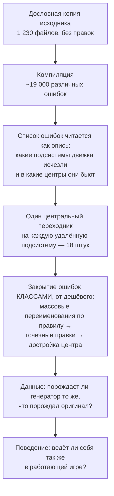

**Русский** · [English](README.md)

# GregTech 6 для NeoForge

[](https://github.com/wolfram0108/gregtech6_w/actions/workflows/build.yml)
[](https://github.com/wolfram0108/gregtech6_w/releases)
[](LICENSE)

**Порт [GregTech 6](https://github.com/GregTech6/gregtech6) — мода Gregorius Techneticies для
Minecraft 1.7.10 — на Minecraft 26.1.2 / NeoForge.**

> **Это неофициальный порт.** Он не связан с Gregorius Techneticies и командой GregTech 6, не одобрен
> и не поддерживается ими. О проблемах сообщайте *сюда*, а не в оригинальный проект — баги наши, не
> их. Происхождение каждого компонента сборки разобрано в [NOTICE](NOTICE).

| | |
|---|---|
| Minecraft | `26.1.2` |
| NeoForge | `26.1.2.84` |
| Java | 25 |
| Исходник | GregTech 6 `v6.17.06` (Minecraft 1.7.10, Forge 10.13.4) |
| Лицензия | LGPL-3.0-or-later, унаследована от оригинала |

> ### ⚠️ Альфа
>
> Мод собирается, запускается на клиенте и выделенном сервере, генерирует мир и играется от начала
> до конца. Но он **не закончен**. Будут баги, сохранения могут не пережить обновление — не берите
> мир, который вам дорог. Всё, что заведомо не доделано, перечислено в разделе
> [Текущее состояние](#текущее-состояние), а не оставлено вам на самостоятельное открытие.

---

## Содержание

- [Что такое GregTech 6](#что-такое-gregtech-6)
- [Почему этот порт сложен](#почему-этот-порт-сложен)
- [Архитектура, которая обязана была пережить перенос](#архитектура-которая-обязана-была-пережить-перенос)
- [Как порт был выполнен](#как-порт-был-выполнен)
- [Восемнадцать швов](#восемнадцать-швов)
- [Чем судится правильность](#чем-судится-правильность)
- [Текущее состояние](#текущее-состояние)
- [Сборка](#сборка)
- [Запуск](#запуск)
- [Тесты](#тесты)
- [Инструменты разработки](#инструменты-разработки)
- [Непрерывная интеграция](#непрерывная-интеграция)
- [Как проверить скачанное](#как-проверить-скачанное)
- [Совместимость с модами](#совместимость-с-модами)
- [Как сообщать о проблемах](#как-сообщать-о-проблемах)
- [Лицензия и благодарности](#лицензия-и-благодарности)

---

## Что такое GregTech 6

GregTech 6 превращает Minecraft в игру о промышленных процессах. Руда здесь — не «железная руда,
которая плавится в железо», а материал: со своим химическим составом, твёрдостью, температурой
плавления, набором побочных продуктов и местом в цепочке переработки. Цепочка тянется от ручного
молотка через печи, дробилки, центрифуги, котлы, двигатели и многоблочные реакторы до логистики
жидкостей под давлением. У дерева, камня, каучука, сплавов и десятков жидкостей — свои цепочки, а
ванильные не соседствуют с гректеховскими, а заменяются ими.

Технически необычно здесь другое: почти ничего из этого не написано руками. GT6 построен на
**матрице «материал × префикс»**: он знает несколько сотен материалов и несколько сотен форм
предмета («слиток», «пыль», «малая шестерня», «двойная пластина»…) и **порождает** предметы, блоки,
записи словаря руд, текстуры, имена, рецепты и поведение машин прямо при загрузке — по правилам для
каждого сочетания. По сути мод — это один большой генератор и данные, которыми он питается.

Для порта это важнее любой отдельной механики. Переносить **выхлоп** генератора бессмысленно —
пережить переезд обязан **сам генератор** вместе с точным порядком, в котором он отрабатывает,
потому что всё остальное в моде из него выводится.

Масштаб для понимания: около 200 000 строк Java в ~1 230 классах плюс порядка 20 000 файлов ресурсов.

## Почему этот порт сложен

GregTech 6 написан под Minecraft 1.7.10 (2014 год). Между той версией и 26.1.2 практически каждая
подсистема движка, на которой стоит мод, была не «объявлена устаревшей», а **удалена**:

| Что GT6 использует в 1.7.10 | Что с этим стало |
|---|---|
| Метаданные предмета (`ItemStack` = предмет + значение прочности) | удалены; личность предмета — это предмет + компоненты данных |
| Метаданные блока (0–15 на позицию) | удалены; блок — единое состояние |
| Система «материал блока» (камень / дерево / металл…) | удалена как понятие |
| Немедленный рендер (`IIcon`, `Tessellator`, вызовы GL, TESR) | удалён; всё рисуется запечёнными моделями |
| Словарь руд Forge (`OreDictionary`) | удалён |
| `IWorldGenerator` (императивная генерация мира) | заменён на data-driven фичи и модификаторы биомов |
| Система жидкостей (`Fluid`, `BlockFluidClassic`) | разобрана и перестроена заново |
| Сетевой слой (`SimpleNetworkWrapper`) | заменён |
| Регистрация ванильных рецептов из кода | удалена; рецепты — это JSON датапака |
| Точка входа coremod / трансформация байткода | удалена |
| Работа с GUI (`IGuiHandler`, `Container`, `GuiScreen`) | заменена |
| Достижения | заменены на продвижения, с другими побочными эффектами |

Мод, который движок просто *использует*, переживает такие перемены подсистема за подсистемой. GT6 —
не может, и причина структурная: это **монолит**. Его определяющее свойство — и причина, по которой
он тянет сотни материалов, не разваливаясь, — в том, что разговор с движком ведётся в **одном**
месте. Один модуль говорит с миром, один — со стеками предметов, один — с NBT, один — со словарём
руд, и весь мод обращается только туда, всегда. Граф зависимостей исходника показывает 272 класса в
одной сильносвязной компоненте: узел, который невозможно разрезать на независимо портируемые куски.

Поэтому у порта нет пути «начнём с маленькой фичи и разрастёмся». Либо фундамент встаёт целиком,
либо не работает ничего.

## Архитектура, которая обязана была пережить перенос

В GregTech 6 около 200 000 строк в ~1 230 классах, но сложность не в объёме. Всё решают два
структурных свойства.

**Это генератор, а не каталог.** Мод объявляет ~407 материалов и ~453 префикса — формы вроде слитка,
пыли, малой шестерни, двойной пластины — и выводит остальное: предметы и блоки, записи словаря руд,
текстуры, имена, подсказки, ~196 жидкостей и рецепты для ~85 типов машин. Материал несёт состав,
твёрдость, температуру плавления, побочные продукты, качество инструмента; генератор читает это и
порождает мир мода при загрузке. Перенести выхлоп — получить снимок, который не растёт. Перенести
генератор — и всё выведенное из него придёт следом.

**Он говорит с движком в одном месте на каждый предмет разговора.** Это и делает GregTech 6
необычным, и это причина, по которой порт вообще возможен:

| Центр | Чем владеет |
|---|---|
| доступ к миру | всякое чтение и запись блоков, позиций, меты, тайл-сущностей |
| стеки предметов | создание, сравнение, размер, идентичность, «пусто ли здесь» |
| NBT | чтение и запись, включая причуды ключей неверного типа |
| словарь руд | регистрация, поиск, цели унификации |
| материалы и префиксы | сама матрица генератора |
| присутствие модов | установлен ли другой мод — один и тот же вопрос в ~120 местах |
| константы и флаги | общая конфигурация, которую читает весь мод |
| реестр машин | машина — это *запись реестра с параметрами*, а не класс: тысячи машин из пары десятков поведений |

Мимо этих центров не ходит никто. Когда движок убрал мету блока, порт не тронул ~1 200 мест, которые
её читают: изменилось внутреннее устройство центра доступа к миру, а места вызова остались буквально
теми, что написал Gregorius.

**Следствие: его нельзя нарезать.** Граф зависимостей исходника кладёт 272 класса в одну
сильносвязную компоненту. Пути «начнём с котла и разрастёмся» не существует — фундамент встаёт
целиком, либо не работает ничего. Это отсекло обычную пошаговую стратегию ещё до переноса первой
строки.

## Как порт был выполнен



Скопировать 200 000 строк на движок, который их не соберёт, — намеренный первый ход: получившийся
список ошибок есть опись, составленная компилятором, а не чьим-то мнением о том, что «наверное,
требует внимания». Каждое расхождение двух движков — перечислено, посчитано и убывает по ходу работы.
Швы выведены из этого списка, наложенного на граф зависимостей, а не из списка желаемых фич.

Дальше ошибки закрывались **классами, а не файлами**. «Этот вызов переименован» — правило, которое
применяется сразу к пятистам местам и делается механически; «этот файл сломан» — пятьсот отдельных
суждений. Если класс ошибок не закрывался правилом, это и был сигнал, что найден настоящий шов и
центр должен дорасти.

Работа, которую нельзя было доделать на месте, помечалась в коде и считалась скриптом. Этот счётчик —
мера честности всей затеи: 43 → 28 → 23 → 10 → 7 → 5 → 0, и CI проверяет его на каждый push, чтобы
новая отложенность оставалась видимой, а не копилась тихо.

## Восемнадцать швов

Места, где у исходной конструкции нет аналога вообще. Каждый — одна централизованная замена, а не
семейство локальных обходов:

| Что удалено в современном движке | Чем заменено |
|---|---|
| метаданные предмета | один предмет на форму + компонент данных с материалом |
| трансформация байткода coremod'ом | миксины поверх тех же методов, что правил оригинал, плюс access-трансформеры |
| немедленный рендер | запечённые модели поверх собственного текстурного слоя GT6; форма по соединениям — через модельные данные |
| словарь руд Forge | собственный реестр GT6 — у него и так был более богатый слой над форджевым |
| система жидкостей | данные жидкостей как есть; мировые жидкости пересажены на движковый блок жидкости, чтобы ожили ванильные взаимодействия (заморозка, губка, вёдра, встреча лавы с водой), при сохранении конечно-квантового растекания GT6 |
| императивная генерация мира | исходные алгоритмы жил и слоёв, обёрнутые в движковые фичи и расставленные модификаторами биомов |
| сетевой слой | те же пакеты поверх современного API полезной нагрузки |
| сырой NBT как канал данных | мост, сохраняющий исходные ключи и семантику, включая причуды |
| система «материал блока» | категории 1.7.10 пересобраны признаками плюс один мост в современные свойства блока |
| межмодовая совместимость через `@Optional` | центр присутствия модов сохранён; чужие API отзеркалены только на время компиляции |
| регистрация рецептов из кода | процедурная генерация в собственный буфер рецептов GT6, отдаваемый движку одним диспетчером |
| жизненный цикл мода FML | собственный центр жизненного цикла не тронут; современными сделаны только внешние точки входа |
| метаданные позиции блока | центр доступа к миру сохраняет старые сигнатуры; собственные блоки несут расширенную мету |
| стек GUI | один поставщик меню, один тип меню, исходная маршрутизация сохранена |
| `null` как «пустой предмет» | GT6 внутри держит свою модель; преобразование — на перечисленном наборе границ с движком |
| обязательные кодеки блоков | одна централизованная заглушка: блоки GT6 процедурны и никогда не data-driven |
| API чтения NBT | хелперы чтения централизованы с сохранением поведения 1.7.10 при неверном типе ключа |
| достижения | пустая операция: современная выдача тянет побочные эффекты, которых у оригинала не было |

## Чем судится правильность

Оригинал — не документация для чтения, а **референс-реализация, которую можно запустить**. Установка
1.7.10 держится инструментированной: у неё спрашивают, что она делает; у порта спрашивают то же и тем
же способом; ответы сравнивают.

| Уровень | На какой вопрос отвечает |
|---|---|
| Компилятор | существует ли и связывается ли |
| Сверка с оригиналом | порождает ли генератор те же материалы, предметы, записи словаря руд, рецепты, определения генерации мира и имена |
| Пробы внутри движка | ведёт ли себя так же настоящий путь движка — какой блок реально встал, что реально легло в слот, что машина реально потребила и выдала |
| Парный замер | для поведения, которое существует только на ходу (растекание жидкости, тайминги машин), один измеритель встраивается в **обе** версии и один сценарий проигрывается в каждой |
| Игра | всё, чего инструменты не видят |

Два правила не дают этому лгать, и оба куплены провалами:

* **Сравнение стоит ровно столько, какова его область.** Совпавшие данные доказывают, что совпадает
  **выхлоп** генератора. Они ничего не говорят о том, доходит ли результат до игрока: предмет может
  быть верен во всех реестрах и при этом быть невидимым, недостижимым или неверно отрисованным.
* **Проверка, которая не может упасть, — не проверка.** Каждое сравнение один раз прогоняется в
  состоянии, где оно заведомо сломано, — чтобы убедиться, что оно вообще способно увидеть разницу.

## Текущее состояние

**Работает и наиграно**

* Клиент и выделенный сервер запускаются; миры генерируются и играются.
* Генератор материалов и префиксов, цепочки переработки руды, словарь руд, генерация рецептов.
* Генерация мира: руды, жилы, слои пород, деревья и растения, родники, подземелья.
* Машины, энергия (электричество, пар, кинетика), трубы и провода, многоблоки, логистика предметов
  и жидкостей.
* Крафт — и ванильный верстак, и собственное крафт-поведение GT6.
* Рендер, вкладки креатива, интеграция с JEI, подсказки, модели предметов и блоков, отрисовка
  жидкостей.
* Замена ванильного поведения: вода GT6, правила инструментов, уровни добычи, прочность блоков.

* Каверы — фильтры, детекторы, шаттеры, текстурные, насосы.

**Известные расхождения с оригиналом**

* Небольшое число рецептов верстака расходится с оригиналом по составу ore-списков.

**Предупреждения альфы**

* Миры не гарантированно переживают обновления. Часть исправлений действует только на заново
  сгенерированные чанки — данные, разрушенные ранней сборкой, восстановить нельзя.
* Игра на выделенном сервере — самая свежая и наименее обкатанная часть проекта.

## Сборка

Нужны **JDK 25**, около **8 ГБ свободной оперативной памяти** и **10 ГБ на диске**. Первая сборка
скачивает NeoForge и декомпилирует Minecraft — именно ради этого нужна память (декомпилятор
наследует кучу Gradle-JVM, заданную в `gradle.properties` как 6 ГБ) — и идёт долго. Последующие
сборки быстрые.

```bash
./gradlew build       # компиляция, jar, тесты
./gradlew assemble    # только артефакт -> build/libs/gregtech6-<версия>.jar
./gradlew compileJava # только компиляция
```

## Запуск

```bash
./gradlew runClient   # клиент разработки
./gradlew runServer   # выделенный сервер (свой каталог: ./runserver)
./gradlew runData     # перегенерация генерируемых файлов данных
```

Клиент и сервер намеренно используют разные игровые каталоги, поэтому могут работать одновременно.

Есть один опциональный флаг сборки — `-Pgt6probes`: он подключает внутриигровую проверочную
оснастку, которая лежит **вне этого репозитория** (в рабочей среде разработчика, каталог `../stands`).
В репозитории её нет вовсе, поэтому она не может попасть в jar игрока; при наличии каталога и флага
`runClient`/`runServer` умеют прогонять проверки прямо в игре.

## Тесты

**В этом репозитории тестов нет.** Проверка — оснастка, а не продукт: тесты, внутриигровые стенды и
сверка с оригиналом живут рядом с репозиторием, в рабочей среде разработчика (`../stands/`), а
репозиторий содержит только мод и то, без чего его не собрать и не опубликовать.

Если этот каталог на месте, `./gradlew test` подхватывает тесты сам (`build.gradle` подключает
`../stands/*/test-java`) и гоняет восемь проверок: мод поднимается в headless-сервере; генератор
материалов и префиксов, поиск рецепта по входам, жидкости материалов, передача энергии и машина,
прогоняющая полный цикл обработки по тикам, работают на замеренном уровне; два возвратных дефекта —
тонкий коллайдер решёток GT6 и «ноль с памятью типа» — остаются починенными. Без каталога запускать
нечего, и `./gradlew build` просто собирает мод.

Что именно утверждает каждая проверка, какие за ней стоят замеренные пороги и по какому правилу
добавляется новая — описано рядом с самими тестами.

## Инструменты разработки

Три вещи — **оснастка проверки**, а не часть продукта, и в этом репозитории их **нет**: они живут
рядом с ним, в рабочей среде разработчика (`../stands`). Приборы не уходят наружу вместе с модом.
Обе подключаются к сборке только по требованию и в простое ничего не стоят.

| Инструмент | На какой вопрос отвечает | Как запустить |
|---|---|---|
| **Сверка с оригиналом** | «порождает ли мод ровно то же, что GregTech 6 на 1.7.10?» — материалы, предметы, словарь руд, рецепты, генерация мира, имена | `./gradlew test -Pgt6.oracle=<путь>` |
| **Стенды внутри движка** | «что на самом деле делает настоящий путь движка?» — проводит реальные взаимодействия и судит идентичность объектов, а не картинку | `./gradlew runClient -Pgt6probes` |
| **Тесты продукта** | «жив ли мод и работают ли его подсистемы на замеренном уровне?» — восемь проверок в headless-сервере | `./gradlew test` |

Сверке нужны дампы, снятые с работающей установки 1.7.10, — около 200 МБ, они снимаются отдельным
дампером и намеренно **не входят** в этот репозиторий; тот же путь к дампам подключает и её код.
Без пути такие проверки просто не выполняются: этап порта завершён, и вопрос задаётся при
расследовании расхождения, а не на каждой сборке.

Если вы склонировали только этот репозиторий, оба инструмента отсутствуют — и это не поломка:
продукту они не нужны, и `gradlew build` собирает мод сам по себе.

## Непрерывная интеграция

Сборка проверяется на чистой машине — другая ОС, пустой кэш, ничего, кроме содержимого этого
репозитория. Запускается **по требованию** (Actions → CI → Run workflow) и автоматически на pull
request; на каждый коммит намеренно не срабатывает — сборка и так гоняется локально, а дубль давал бы
только шум.

Два задания, параллельно:

| Задание | Что проверяет |
|---|---|
| **Сборка** | собирает jar мода, затем проверяет, что в jar нет compile-only классов-подставок для пакетов, которыми владеет движок (с ними мод не грузится — это уже случалось однажды), и что метки незавершённой работы в исходнике не накапливаются |
| **Сервер** | поднимает выделенный сервер и требует, чтобы он дошёл до «Done». Ни один юнит-тест этого не видит: они поднимают сервер без мира и без клиентской стороны, а ломался за месяц именно дедикейт — трижды |

Тег релиза (`v<версия>`) собирает jar, проверяет, что тег совпадает с версией в `gradle.properties`,
и публикует GitHub-релиз — для alpha, beta и rc с пометкой pre-release.

## Как проверить скачанное

Мод исполняется внутри вашей игры как обычный код, с вашими правами. Поэтому честный вопрос звучит
не «дошёл ли файл целым», а «тот ли это файл, что собран из исходника, который вы можете прочитать».
Оба ответа проверяются **без доверия ко мне**.

```bash
gh attestation verify gregtech6-<версия>.jar --repo wolfram0108/gregtech6_w
```

GitHub сам засвидетельствовал, что именно этот файл произведён релизным workflow этого репозитория
из помеченного тегом коммита, и подписал это утверждение. Файл, пересобранный или изменённый кем-то
другим, проверку не проходит.

Более сильная проверка — пересобрать самому. Времена и порядок записей в архиве зафиксированы,
поэтому сборка тега дважды — на любой машине — даёт **побайтово одинаковый** jar:

```bash
git checkout v<версия> && ./gradlew assemble
sha256sum build/libs/*.jar     # обязан совпасть с опубликованным .sha256
```

Это измерено, а не задумано. Собранный на Windows jar и собранный CI на Ubuntu из того же коммита
побайтово совпадают, и digest, который удостоверяет GitHub, — тот самый, что даёт локальная сборка.
Чтобы этого добиться, пришлось устранить две разные причины: времена и порядок записей в архиве, а
затем переводы строк — Windows разворачивает их при выгрузке, и они уезжают в jar как лежат на
диске. Один раз настройки намеренно отключались, чтобы убедиться, что проверка способна
провалиться: без них тот же исходник дал два разных jar.

Кодовой подписи у jar **нет**, и это намеренно: NeoForge подписи модов не проверяет вовсе — он
грузит классы с `(CodeSigner[]) null`, — так что самоподписанный сертификат добавил бы обряд без
проверяющего.

## Совместимость с модами

| Мод | Состояние |
|---|---|
| **JEI** | поддержан — категории рецептов GT6 и варианты предметов просматриваются |
| **Jade** | поддержан — GT6 регистрирует собственные инструменты (ключ, лом, кусачки…), которых не выразить ванильными тегами, поэтому подсказки о добыче верны |
| **JourneyMap** и ванильная карта | поддержаны — блоки и жидкости GT6 отрисовываются на обеих |
| промышленные моды эпохи 1.7.10 | не подключены, см. [Текущее состояние](#текущее-состояние) |

## Как сообщать о проблемах

Самый полезный отчёт называет симптом и условия:

1. что вы делали — блок, предмет, машина, точное взаимодействие;
2. что произошло и как вместо этого ведёт себя GregTech 6 на 1.7.10;
3. одиночная игра или выделенный сервер, свежий мир или старый;
4. `logs/latest.log` и `gregtech.log`, а если был краш — отчёт о нём.

«Ведёт себя не так, как в оригинале» — самый ценный вид отчёта для порта, даже когда текущее
поведение выглядит разумным. Такие отчёты обычно указывают на недостающую деталь порта, а не на то
единственное, что вы заметили; для этого случая заведён отдельный шаблон.

Всё, что позволяет клиенту уронить выделенный сервер, получить чужие данные или выполнить код, идёт
не сюда, а через приватный канал: [SECURITY.md](SECURITY.md).

Присылаете код, а не отчёт: [CONTRIBUTING.md](CONTRIBUTING.md) — там два правила, которыми держится
эта кодовая база. Что изменилось между версиями: [CHANGELOG.md](CHANGELOG.md).

## Лицензия и благодарности

GregTech 6 — © Gregorius Techneticies, распространяется под **GNU Lesser General Public License,
версия 3 или новее** (`LICENSE`, `COPYING.LESSER`). Этот порт — производная работа и распространяется
на тех же условиях. Файлы, перенесённые из оригинала, сохраняют исходные уведомления и несут пометку,
что изменены для порта; файлы, написанные для порта, говорят об этом прямо.

Ресурсы, если не указано иное, переданы в общественное достояние по CC0 1.0 (`LICENSE.assets`);
ресурсы, содержащие логотип GregTech или его производные, — под CC BY-NC 4.0 (`LICENSE.logos`).
**Ни одного файла логотипа GregTech в сборке нет** — текст той лицензии едет только затем, чтобы
условия сопровождали работу, если логотип когда-нибудь появится.

В [NOTICE](NOTICE) разобрано происхождение каждого компонента: какие ресурсы пришли из оригинала без
изменений, какие сделаны здесь и почему в jar есть классы в пространствах имён чужих модов (это
написанные с нуля заглушки, а не код тех проектов).

* **Gregorius Techneticies** — автор GregTech 6. Этот проект переносит его работу на новый движок;
  замысел, баланс и идеи — его.
* **NeoForged** — загрузчик модов и его документация.
