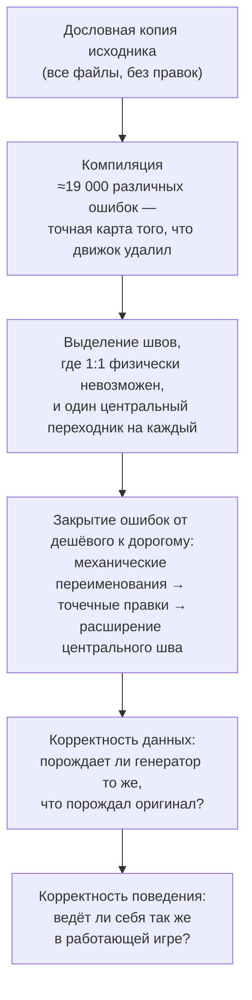

**Русский** · [English](README.md)

# GregTech 6 для NeoForge

[](https://github.com/wolfram0108/gregtech6_w/actions/workflows/build.yml)
[](https://www.minecraft.net/)
[](https://neoforged.net/)
[](LICENSE)

**Порт [GregTech 6](https://github.com/GregTech6/gregtech6) — мода Gregorius Techneticies для
Minecraft 1.7.10 — на Minecraft 26.1.2 / NeoForge.**

| | |
|---|---|
| Версия мода | `6.0.0-alpha.1` |
| Minecraft | `26.1.2` |
| NeoForge | `26.1.2.77` |
| Java | 25 |
| Исходник | GregTech 6 `v6.17.06` (Minecraft 1.7.10, Forge 10.13.4) |
| Лицензия | LGPL-3.0-or-later, унаследована от оригинала |

> ### ⚠️ Альфа
>
> Мод собирается, запускается на клиенте и выделенном сервере, генерирует мир и играется от начала
> до конца. Но он **не закончен**. Будут баги, сохранения могут не пережить обновление — не берите
> мир, который вам дорог. Всё, что заведомо не доделано, перечислено в разделе
> [Текущее состояние](#текущее-состояние), а не оставлено вам на самостоятельное открытие.

---

## Содержание

- [Что такое GregTech 6](#что-такое-gregtech-6)
- [Почему этот порт сложен](#почему-этот-порт-сложен)
- [Как делается порт](#как-делается-порт)
- [Текущее состояние](#текущее-состояние)
- [Сборка](#сборка)
- [Запуск](#запуск)
- [Тесты](#тесты)
- [Инструменты разработки](#инструменты-разработки)
- [Непрерывная интеграция](#непрерывная-интеграция)
- [Совместимость с модами](#совместимость-с-модами)
- [Как сообщать о проблемах](#как-сообщать-о-проблемах)
- [Лицензия и благодарности](#лицензия-и-благодарности)

---

## Что такое GregTech 6

GregTech 6 превращает Minecraft в игру о промышленных процессах. Руда здесь — не «железная руда,
которая плавится в железо», а материал: со своим химическим составом, твёрдостью, температурой
плавления, набором побочных продуктов и местом в цепочке переработки. Цепочка тянется от ручного
молотка через печи, дробилки, центрифуги, котлы, двигатели и многоблочные реакторы до логистики
жидкостей под давлением. У дерева, камня, каучука, сплавов и десятков жидкостей — свои цепочки, а
ванильные не соседствуют с гректеховскими, а заменяются ими.

Технически необычно здесь другое: почти ничего из этого не написано руками. GT6 построен на
**матрице «материал × префикс»**: он знает несколько сотен материалов и несколько сотен форм
предмета («слиток», «пыль», «малая шестерня», «двойная пластина»…) и **порождает** предметы, блоки,
записи словаря руд, текстуры, имена, рецепты и поведение машин прямо при загрузке — по правилам для
каждого сочетания. По сути мод — это один большой генератор и данные, которыми он питается.

Для порта это важнее любой отдельной механики. Переносить **выхлоп** генератора бессмысленно —
пережить переезд обязан **сам генератор** вместе с точным порядком, в котором он отрабатывает,
потому что всё остальное в моде из него выводится.

Масштаб для понимания: около 200 000 строк Java в ~1 230 классах плюс порядка 20 000 файлов ресурсов.

## Почему этот порт сложен

GregTech 6 написан под Minecraft 1.7.10 (2014 год). Между той версией и 26.1.2 практически каждая
подсистема движка, на которой стоит мод, была не «объявлена устаревшей», а **удалена**:

| Что GT6 использует в 1.7.10 | Что с этим стало |
|---|---|
| Метаданные предмета (`ItemStack` = предмет + значение прочности) | удалены; личность предмета — это предмет + компоненты данных |
| Метаданные блока (0–15 на позицию) | удалены; блок — единое состояние |
| Система «материал блока» (камень / дерево / металл…) | удалена как понятие |
| Немедленный рендер (`IIcon`, `Tessellator`, вызовы GL, TESR) | удалён; всё рисуется запечёнными моделями |
| Словарь руд Forge (`OreDictionary`) | удалён |
| `IWorldGenerator` (императивная генерация мира) | заменён на data-driven фичи и модификаторы биомов |
| Система жидкостей (`Fluid`, `BlockFluidClassic`) | разобрана и перестроена заново |
| Сетевой слой (`SimpleNetworkWrapper`) | заменён |
| Регистрация ванильных рецептов из кода | удалена; рецепты — это JSON датапака |
| Точка входа coremod / трансформация байткода | удалена |
| Работа с GUI (`IGuiHandler`, `Container`, `GuiScreen`) | заменена |
| Достижения | заменены на продвижения, с другими побочными эффектами |

Мод, который движок просто *использует*, переживает такие перемены подсистема за подсистемой. GT6 —
не может, и причина структурная: это **монолит**. Его определяющее свойство — и причина, по которой
он тянет сотни материалов, не разваливаясь, — в том, что разговор с движком ведётся в **одном**
месте. Один модуль говорит с миром, один — со стеками предметов, один — с NBT, один — со словарём
руд, и весь мод обращается только туда, всегда. Граф зависимостей исходника показывает 272 класса в
одной сильносвязной компоненте: узел, который невозможно разрезать на независимо портируемые куски.

Поэтому у порта нет пути «начнём с маленькой фичи и разрастёмся». Либо фундамент встаёт целиком,
либо не работает ничего.

## Как делается порт

### 1. Портировать, а не переписывать

Играть вы должны в GregTech 6, а не в «мод по мотивам». Значение по умолчанию — **дословный
перенос**: меняется только тот символ, который компилятор или движок физически отвергает, и меняется
минимально.

| Можно | Нельзя |
|---|---|
| заменить вызов API, которого больше нет | перестраивать поток управления |
| подогнать сигнатуру, которую требует движок | сливать, дробить, переставлять методы |
| осознанно спроектированная замена удалённой подсистемы | «заодно улучшить» конструкцию, через которую проходишь |
| зафиксировать вынужденное отклонение как решение | придумывать поведение или константы, которых нет в исходнике |

Это включает воспроизведение решений, которые выглядят неоптимальными. В настолько связанной системе
«очевидное улучшение» обычно оказывается предположением о порядке загрузки, которое держит модуль
через три уровня в стороне, — и порт не то место, где стоит это выяснять.

### 2. Адаптировать централизованно, а не пофайлово

Там, где движок вынуждает измениться, изменение проектируется **один раз** и кладётся туда, где GT6
и без того держит этот разговор, — а дальше весь мод идёт через него ровно так же, как раньше.

Альтернатива — то, что обычно и происходит с крупными портами: каждый файл латают там, где он
сломался, заплатки расходятся между собой, и центральные абстракции мода тихо превращаются в тысячу
локальных переводов, которые уже никто не удержит в согласии. Конкретно: метаданных позиции блока
больше нет, но модуль доступа к миру сохранил исходные сигнатуры 1.7.10 и переводит внутри себя — так
что ~1 200 мест вызова по всему моду остались буквально теми, что написал Gregorius, а вся адаптация
— один файл, который можно прочитать за вечер.

Правило по всему проекту: **где у оригинала одна деталь — в порте одна деталь.**

### 3. Процесс



Необычен здесь первый шаг. Скопировать 200 000 строк на движок, который их не может собрать,
выглядит странным началом — но получившийся список ошибок и есть самая честная опись работы из
возможных: каждое место, где два движка расходятся, перечислено компилятором, а не чьим-то суждением
о том, что «наверное, требует внимания». Швы на шаге 3 выбраны из этой описи и из графа зависимостей,
а не из списка фич.

### 4. Швы с движком

Найдено восемнадцать несовместимостей, где у исходной конструкции просто нет аналога. Каждая —
одна централизованная замена, а не семейство локальных обходов:

| Что удалено в современном движке | Чем заменено |
|---|---|
| метаданные предмета | один предмет на форму + компонент данных с материалом |
| трансформация байткода coremod'ом | миксины поверх тех же методов, что правил оригинал, плюс access-трансформеры |
| немедленный рендер | запечённые модели поверх собственного текстурного слоя GT6; форма по соединениям — через модельные данные |
| словарь руд Forge | собственный реестр GT6 (у него и так был более богатый слой над форджевым) |
| система жидкостей | данные жидкостей GT6 как есть; мировые жидкости пересажены на движковый блок жидкости, чтобы ожили ванильные взаимодействия (заморозка, губка, вёдра, встреча лавы с водой), при сохранении собственного конечно-квантового растекания GT6 |
| императивная генерация мира | исходные алгоритмы жил и слоёв, обёрнутые в движковые фичи и расставленные модификаторами биомов |
| сетевой слой | те же пакеты поверх современного API полезной нагрузки |
| сырой NBT как канал данных | мост, сохраняющий исходные ключи и семантику, включая её причуды |
| система «материал блока» | система 1.7.10 скопирована дословно плюс один мост в современные свойства блока |
| межмодовая совместимость через `@Optional` | реестр присутствия модов GT6 сохранён; чужие API отзеркалены только на время компиляции |
| регистрация рецептов из кода | процедурная генерация в собственный буфер рецептов GT6, отдаваемый движку одним диспетчером |
| жизненный цикл мода FML | собственный центр жизненного цикла мода не тронут; современными сделаны только внешние точки входа |
| метаданные позиции блока | центральный модуль доступа к миру сохраняет старые сигнатуры; собственные блоки несут расширенную мету |
| стек GUI | один поставщик меню, один тип меню, исходная маршрутизация сохранена |
| `null` как «пустой предмет» | GT6 внутри держит свою модель; преобразование происходит на перечисленном наборе границ с движком |
| обязательные кодеки блоков | одна централизованная заглушка — блоки GT6 процедурны и никогда не data-driven |
| API чтения NBT | хелперы чтения централизованы с сохранением поведения 1.7.10 при неверном типе ключа |
| достижения | пустая операция: современная выдача тянет побочные эффекты, которых у оригинала не было |

### 5. Чем судится правильность

Порт нельзя проверить чтением. 200 000 строк процедурно переплетённого кода дают бесконечные
возможности уверенно ошибиться, и чтение исходника 1.7.10 не раз давало уверенно неверный ответ.
Поэтому оригинал здесь — не документация, а **референс-реализация, которую можно запустить**.

Мод 1.7.10 держится живой инструментированной сборкой. Его спрашивают, что он делает; порт
спрашивают о том же и тем же способом; ответы сравнивают.

| Уровень | На какой вопрос отвечает |
|---|---|
| Компилятор | существует ли и связывается ли |
| Сравнение данных с оригиналом | порождает ли генератор те же материалы, предметы, записи словаря руд, рецепты, определения генерации мира и имена |
| Пробы внутри движка | ведёт ли себя так же настоящий путь движка — какой блок реально встал, что реально легло в слот, что машина реально потребила и выдала |
| Парный замер | для поведения, которое существует только на ходу (растекание жидкости, тайминги машин), один и тот же измеритель встраивается в **обе** версии и один и тот же сценарий проигрывается в каждой |
| Игра | всё, чего не видит ни один из уровней выше |

Эта дисциплина навязывает две вещи, обе выучены дорогой ценой:

* **Сравнение стоит ровно столько, какова его область.** Совпавшие дампы доказывают, что совпадает
  **выхлоп** генератора. Они ничего не говорят о том, доходит ли результат до игрока: предмет может
  быть верен во всех реестрах и при этом быть невидимым, недостижимым или неверно отрисованным.
  Каждый уровень закрывает только свой вопрос.
* **Проверка, которая не может упасть, — не проверка.** Каждое сравнение один раз прогоняется в
  состоянии, где оно заведомо сломано, — чтобы убедиться, что оно вообще способно увидеть разницу.

## Текущее состояние

**Работает и наиграно**

* Клиент и выделенный сервер запускаются; миры генерируются и играются.
* Генератор материалов и префиксов, цепочки переработки руды, словарь руд, генерация рецептов.
* Генерация мира: руды, жилы, слои пород, деревья и растения, родники, подземелья.
* Машины, энергия (электричество, пар, кинетика), трубы и провода, многоблоки, логистика предметов
  и жидкостей.
* Крафт — и ванильный верстак, и собственное крафт-поведение GT6.
* Рендер, вкладки креатива, интеграция с JEI, подсказки, модели предметов и блоков, отрисовка
  жидкостей.
* Замена ванильного поведения: вода GT6, правила инструментов, уровни добычи, прочность блоков.

* Каверы — фильтры, детекторы, шаттеры, текстурные, насосы.

**Известные расхождения с оригиналом**

* Рецепты, зависящие от пустых клеток сетки крафта: современная сетка подрезается до того, как её
  видит рецепт, и семантика здесь не разрешена.
* Небольшое число рецептов верстака расходится с оригиналом по составу ore-списков.

**Не начато**

* Интеграция с модами эпохи 1.7.10 (IC2, Forestry, Railcraft, BuildCraft, Thaumcraft и ещё ~45).
  Код совместимости GT6 перенесён и централизован, но ничего современного к нему не подключено —
  эти интеграции мертвы.

**Предупреждения альфы**

* Миры не гарантированно переживают обновления. Часть исправлений действует только на заново
  сгенерированные чанки — данные, разрушенные ранней сборкой, восстановить нельзя.
* Игра на выделенном сервере — самая свежая и наименее обкатанная часть проекта.

## Сборка

Нужны **JDK 25**, около **8 ГБ свободной оперативной памяти** и **10 ГБ на диске**. Первая сборка
скачивает NeoForge и декомпилирует Minecraft — именно ради этого нужна память (декомпилятор
наследует кучу Gradle-JVM, заданную в `gradle.properties` как 6 ГБ) — и идёт долго. Последующие
сборки быстрые.

```bash
./gradlew build       # компиляция, jar, тесты
./gradlew assemble    # только артефакт -> build/libs/gregtech6-<версия>.jar
./gradlew compileJava # только компиляция
```

## Запуск

```bash
./gradlew runClient   # клиент разработки
./gradlew runServer   # выделенный сервер (свой каталог: ./runserver)
./gradlew runData     # перегенерация генерируемых файлов данных
```

Клиент и сервер намеренно используют разные игровые каталоги, поэтому могут работать одновременно.

Есть один опциональный флаг сборки — `-Pgt6probes`: он добавляет в сборку внутриигровые
проверочные пробы (`src/probes/java`). Без него они не компилируются вовсе и не могут попасть в jar
игрока; с ним `runClient`/`runServer` умеют прогонять автоматические проверки прямо в игре.

## Тесты

```bash
./gradlew test    # 13 проверок, ничего сверх репозитория не требуют
```

Тесты поднимают мод внутри headless-сервера и затем нагружают его: генератор материалов и
префиксов, поиск рецепта по входам, машину, прогоняющую полный цикл обработки по тикам, передачу
энергии, регистрацию контента и круг «запись → чтение» для предметов.

## Инструменты разработки

Две вещи в этом репозитории — **оснастка фазы порта**, а не часть продукта. По умолчанию выключены,
в простое ничего не стоят и существуют потому, что порту иногда нужно задавать вопросы, которых
обычный мод не задаёт.

| Инструмент | На какой вопрос отвечает | Как запустить |
|---|---|---|
| **Сверка с оригиналом** | «порождает ли мод ровно то же, что GregTech 6 на 1.7.10?» — материалы, предметы, словарь руд, рецепты, генерация мира, имена | `./gradlew test -Pgt6.oracle=<путь>` |
| **Пробы внутри движка** | «что на самом деле делает настоящий путь движка?» — проводит реальные взаимодействия и судит идентичность объектов, а не картинку | `./gradlew runClient -Pgt6probes` |

Сверке нужны дампы, снятые с работающей установки 1.7.10, — около 200 МБ, они снимаются отдельным
дампером и намеренно **не входят** в этот репозиторий. Без пути такие проверки просто не
выполняются: этап порта завершён, и вопрос задаётся при расследовании расхождения, а не на каждой
сборке.

## Непрерывная интеграция

На каждый push и pull request выполняются три задания:

| Задание | Что проверяет |
|---|---|
| **Сборка** | собирает jar мода, затем проверяет, что в jar нет compile-only классов-подставок для пакетов, которыми владеет движок (с ними мод не грузится — это уже случалось однажды), и что метки незавершённой работы в исходнике не накапливаются |
| **Пробы** | компилирует внутриигровые пробы, которых обычная сборка не касается и которые иначе тихо сгнили бы |
| **Тесты** | прогоняет набор тестов и сравнивает множество падений с записанным базлайном: неизвестное падение валит сборку, и набор, который не запустился вовсе, тоже валит (тест-раннер, тихо не запустивший ничего, не должен читаться как успех) |

Ночной прогон выполняет более тяжёлые проверки: полное сравнение данных с оригиналом, проверку, что
сгенерированные файлы данных всё ещё соответствуют своим генераторам, и запуск выделенного сервера.

Тег релиза (`v<версия>`) собирает jar, проверяет, что тег совпадает с версией в `gradle.properties`,
и публикует GitHub-релиз — для alpha, beta и rc с пометкой pre-release.

## Совместимость с модами

| Мод | Состояние |
|---|---|
| **JEI** | поддержан — категории рецептов GT6 и варианты предметов просматриваются |
| **Jade** | поддержан — GT6 регистрирует собственные инструменты (ключ, лом, кусачки…), которых не выразить ванильными тегами, поэтому подсказки о добыче верны |
| **JourneyMap** и ванильная карта | поддержаны — блоки и жидкости GT6 отрисовываются на обеих |
| промышленные моды эпохи 1.7.10 | не подключены, см. [Текущее состояние](#текущее-состояние) |

## Как сообщать о проблемах

Самый полезный отчёт называет симптом и условия:

1. что вы делали — блок, предмет, машина, точное взаимодействие;
2. что произошло и как вместо этого ведёт себя GregTech 6 на 1.7.10;
3. одиночная игра или выделенный сервер, свежий мир или старый;
4. `logs/latest.log` и `gregtech.log`, а если был краш — отчёт о нём.

«Ведёт себя не так, как в оригинале» — самый ценный вид отчёта для порта, даже когда текущее
поведение выглядит разумным. Такие отчёты обычно указывают на недостающую деталь порта, а не на то
единственное, что вы заметили; для этого случая заведён отдельный шаблон.

Всё, что позволяет клиенту уронить выделенный сервер, получить чужие данные или выполнить код, идёт
не сюда, а через приватный канал: [SECURITY.md](SECURITY.md).

Присылаете код, а не отчёт: [CONTRIBUTING.md](CONTRIBUTING.md) — там два правила, которыми держится
эта кодовая база. Что изменилось между версиями: [CHANGELOG.md](CHANGELOG.md).

## Лицензия и благодарности

GregTech 6 — © Gregorius Techneticies, распространяется под **GNU Lesser General Public License,
версия 3 или новее** (`LICENSE`, `COPYING.LESSER`). Этот порт — производная работа и распространяется
на тех же условиях.

Ресурсы, если не указано иное, переданы в общественное достояние по CC0 1.0 (`LICENSE.assets`);
ресурсы, содержащие логотип GregTech или его производные, — под CC BY-NC 4.0 (`LICENSE.logos`).

* **Gregorius Techneticies** — автор GregTech 6. Этот проект переносит его работу на новый движок;
  замысел, баланс и идеи — его.
* **NeoForged** — загрузчик модов и его документация.
* **Applied Energistics 2** и собственные тестовые моды NeoForge — референсы «как это делается на
  современном движке», доступные только для чтения.
